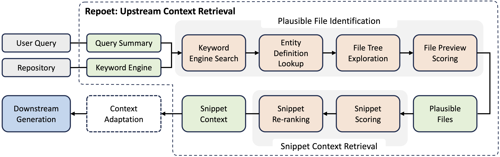

<div align="center">
  
</div>

<div align="center">
    <h1>CodeFuse RepoAgent</h1>
</div>

<div align="center">

  | [中文](docs/README_zh.md) | [English](README.md) |

</div>

<!-- TODO: Add Badges -->

CodeFuse RepoAgent (or CoRA) is a repository-level retrieval-augmented generation agent aiming to address user queries toward a software repository.

---

## 🔥 News

- **[Dec. 1, 2024]** We released CoRA's primary component—the upstream retriever CodeFuse Agentic Retriever (or CFAR).
- **[Dec. 3, 2024]** We released CoRA's downstream issue-fixing agent FixIt!, as well as its SWE-bench variant SWE-kit.

---

## 👏🏻 Overview

CoRA utilizes its upstream agentic retriever, CodeFuse Agentic Retriever (or CFAR), to fetch relevant context. Then, it adapts these relevant context into task-specific, downstream prompt to effectively generate responses to user queries.

To effectively extract the relevant context—certain lines of code or documentation, referred to as snippets—from the repository, CFAR presents a novel yet simple composite approach. CFAR founds on a classical keyword-based search engine, while it employs modern language models (LMs) for further, assistive refinement. CFAR is built upon the key observation that while classical engines may lack some accuracy, the contexts they retrieve are often close to the actual context (or ground truth) necessary to address a user query. The observation is reflected in twofold:
+ Although not significant, the keyword engine is already able to recall a moderate portion of ground-truth files;
+ The files they retrieve are in close proximity to the ground-truth files in terms of the repository structure, and the last mile can be completed by LLMs.



The main usage of CoRA is to resolve issues. Based on CFAR-retrieved contexts, a simple prompt drove CoRA to successfully resolved 95 issues (31.67%) in SWE-bench Lite, where 8 issues are uniquely addressed. This achieved the top ranking among all open-source agents by 23/10/2024 in the leaderboard. The technical report can be found in [arXiv](#).

## 📦 Installation

First create a conda environment:

```shell
conda env create -f environment.yaml
conda activate cora_venv
mv env.template .env  # This saves some environment variables
```

Then follow the below table to setup required library for the model(s) you'd use:
- `√` means the library was already supported.
- `.` means the library has not benn supported yet, but will be supported in the future.
- `x` means the library won't be supported.

|     Library      | Status  | Setup instructions                                                                                                                                              |
|:----------------:|:-------:|:----------------------------------------------------------------------------------------------------------------------------------------------------------------|
|   [OpenAI](#)    |   `√`   | Set up the API [key](https://github.com/openai/openai-python/blob/main/README.md#usage) in `.env`                                                               |
|   [Ollama](#)    |   `√`   | Pull the models first and start Ollama on the local machine, for example [Llama3.2](https://ollama.com/library/llama3.2)                                        |
| [HuggingFace](#) |   `.`   | Either [enable downloading](https://huggingface.co/docs/huggingface_hub/main/en/package_reference/environment_variables) in `.env` or download the models first |
| [EasyDeploy](#)  |   `.`   | Will be supported in the future                                                                                                                                 |


## 🔍 Retrieve Context

CFAR can be executed in separate to retrieve relevant context for a user query:

```shell
python -m cora.cfar         \
    -q <user_query>         \
    -m <lang_model>         \
    <repository>
```

## 🚀 Fix Issues (WIP)

> [!WARNING]
> This section is still working in progress.

CoRA's FixIt! supports generating a plausible patch to fix a given issue for a repository:

```shell
python -m cora.fixit        \
    -q <issue_text>         \
    -i <issue_id>           \
    -m <lang_model>         \
    -e <eval_script>        \
    --eval-args <eval_args> \
    -M <max_retries>        \
    <repository>
```

If an evaluation script (i.e., `-e`) is provided, FixIt! generates a patch until the evaluation script considers the issue has been fixed or FixIt! reaches the max number of allowed attempts. In this context, FixIt! applies the generated patch on the repository and passes the issue and the new repository's path to the evaluation script. Otherwise, FixIt! merely generates a plausible patch without evaluating its correctness.

Below presents a simple evaluation script to save everything passed from FixIt! into `/tmp/test.json` and accepts all patches if there is an "Hello World":

```python
#! /usr/local/bin/python3

import json
import sys

if __name__ == "__main__":
    issue_id = sys.argv[1]
    patch_str = sys.argv[2]
    buggy_repo = sys.argv[3]
    patched_repo = sys.argv[4]

    # Save all arguments passed from FixIt! into /tmp/test.json
    with open("/tmp/test.json", "w") as fou:
        json.dump(
            {
                "issue_id": issue_id,
                "patch": patch_str,
                "buggy_repo": buggy_repo,
                "patched_repo": patched_repo,
            },
            fou,
            ensure_ascii=False,
            indent=2,
        )

    # We accept the patch if there is an "Hello World"
    if "Hello World" in patch_str:
        exit(0)  # Exiting with 0 indicates an acceptance
    else:
        exit(1)  # All other exit status imply a rejection
```

Below is the example content of `/tmp/test.json`:

```json
{
  "issue_id": "django__django-11848",
  "patch": "diff --git a/django/utils/http.py b/django/utils/http.py\n--- a/django/utils/http.py\n+++ b/django/utils/http.py\n@@ -176,7 +176,7 @@\n     try:\n         year = int(m.group('year'))\n         if year < 100:\n-            if year < 70:\n+            if year < 50:\n                 year += 2000\n             else:\n                 year += 1900\n",
  "buggy_repo": "/tmp/fixit/django_f0adf3b9",
  "patched_repo": "/tmp/fixit/patched_django_f0adf3b9"
}
```

## 🐑 Fix SWE-bench (WIP)

> [!WARNING]
> This section is still working in progress

CoRA's SWE-kit supports generating patches for SWE-bench issues. To evaluate if the generated patch can pass SWE-bench, we have to install SWE-bench first:

```shell
git clone git@github.com:princeton-nlp/SWE-bench.git
cd SWE-bench
pip install -e .
```

After that, SWE-kit can generate patches and evaluating the generated patch via SWE-bench.

```shell
python -m cora.swekit       \
    -d <dataset_id>         \
    -m <lang_model>         \
    -M <max_retries>        \
 <instance_id>
```

## 🤖 Answer Questions

CoRA's RepoQA can answer user's questions towards the repository:

```shell
python -m cora.repoqa       \
    -q <user_query>         \
    -m <lang_model>         \
    <repository>
```

## 👨‍💻‍ Contributions

CoRA enforces a series of pre-commit checks that our contributors should follow. Before contributing to this project, developers are required to install our checkers:

```shell
pre-commit install  # install pre-commit itself
pre-commit install-hooks  # install our pre-commit checkers
```

Below are checkers/hooks we have enabled:
+ Python: We use Ruff's lint and format the code; check [all rules](https://docs.astral.sh/ruff/rules/) if your commits fail. Check [ruff.md](./docs/ruff.md) to configure Ruff in PyCharm.
+ Commit: We apply Conventional Commits to format all commit messages; check [the rules](https://www.conventionalcommits.org/) to configure its format.
+ MISC: We also apply some misc checkers for example YAML.

<!-- Add "Cite Us" -->

## 👍 Acknowledgements

- [Sweep](https://github.com/sweepai/sweep)
- [Agentless](https://github.com/OpenAutoCoder/Agentless)
- [SWE-bench](https://www.swebench.com/)
