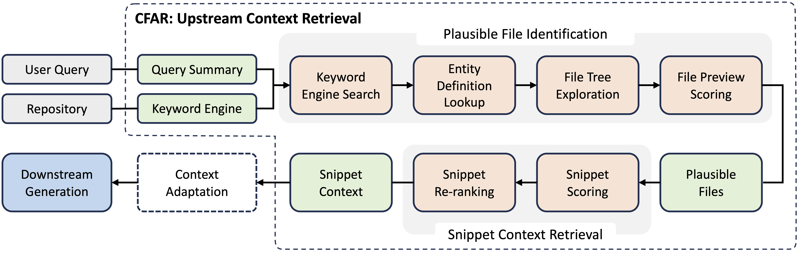

<p style="text-align: center">
  
</p>

<div style="text-align: center">
    <h1>CodeFuse Agent (CoFA)</h1>
</div>

<!-- TODO: Add Badges -->

The CodeFuse Agent (CoFA) is a repository-level retrieval-augmented generation agent aiming to address user queries toward a software repository.

---

## 🔥 News

- **[Dec. 1, 2024]** We have released CoFA's primary component—the upstream retriever CodeFuse Agentic Retriever (CFAR).

---

## 👏🏻 Overview

CoFA utilizes its upstream agentic retriever, the CodeFuse Agentic Retriever (CFAR), to fetch relevant context. Then, it adapts these relevant context into task-specific, downstream prompt to effectively generate responses to user queries.

To effectively extract the relevant context—certain lines of code or documentation, referred to as snippets—from the repository, CFAR presents a novel yet simple composite approach. CFAR founds on a classical keyword-based search engine, while it employs modern language models (LMs) for further, assistive refinement. CFAR is built upon the key observation that while classical engines may lack some accuracy, the contexts they retrieve are often close to the actual context (or ground truth) necessary to address a user query. The observation is reflected in twofold:
+ Although not significant, the keyword engine is already able to recall a moderate portion of ground-truth files;
+ The files they retrieve are in close proximity to the ground-truth files in terms of the repository structure, and the last mile can be completed by LLMs.



The main usage of CoFA is to resolve issues. Based on CFAR-retrieved contexts, a simple prompt drove CoFA to successfully resolved 95 issues (31.67%) in SWE-bench Lite, where 8 issues are uniquely addressed. This achieved the top ranking among all open-source agents by 23/10/2024 in the leaderboard. The technical report can be found in [arXiv](#).

## 📦 Installation

```shell
conda create -f environment.yaml
conda activate cofa_venv
```

## 🔍 Retrieve Context

CFAR (or Repoet) can be executed in separate to retrieve relevant context for a user query:

```shell
python -m cofa.repoet -q <user_query> -m <lang_model> <repository>
```

## 🚀 Fix Issues (WIP)

> [!WARNING]
> This section is still working in progress.

CoFA's Swell agent supports generating a plausible patch to fix a given issue for a repository:

```shell
python -m cofa.swell -i <issue_text> -e <eval_script> -M 20 <repository>
```

If an evaluation script is provided, CoFA generates a patch until the evaluation script considers the issue has been fixed or CoFA reaches the max number of allowed attempts. In this context, CoFA applies the generated patch on the repository and passes the issue and the new repository's path to the evaluation script.

## 👨‍💻‍ Contributions

CoFA enforces a series of pre-commit checks that our contributors should follow. Before contributing to this project, developers are required to install our checkers:

```shell
pre-commit install  # install pre-commit itself
pre-commit install-hooks  # install our pre-commit checkers
```

Below are checkers/hooks we have enabled:
+ Python: We use Ruff's lint and format the code; check [all rules](https://docs.astral.sh/ruff/rules/) if your commits fail. Check [ruff.md](./docs/ruff.md) to configure Ruff in PyCharm.
+ Commit: We apply Conventional Commits to format all commit messages; check [the rules](https://www.conventionalcommits.org/) to configure its format.
+ MISC: We also apply some misc checkers for example YAML.

<!-- Add "Cite Us" -->
