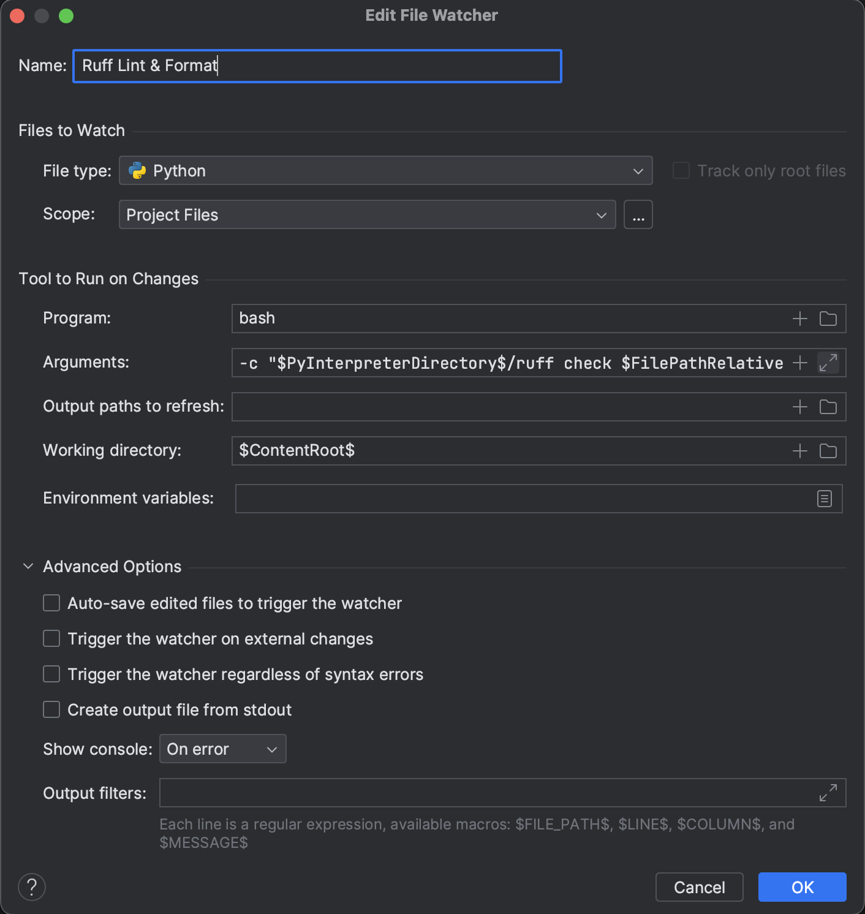

# Configure Ruff's Linter and Formatter

This documents ensures Ruff to lint and format the file on each save action.

## Configure In PyCharm

1. Install CoRA and start CoRA's environment following instructions in [README.md](../README.md).
2. Install Ruff with the version (with a comment `# Ruff version.`) shown in [pre-commit configs](../.pre-commit-config.yaml). For example:

```shell
pip install ruff==v0.7.2  # Change the version accordingly
```

3. Import CoRA into PyCharm; please ensure CoRA's environment has been imported as a common conda environment
4. Open Settings -> Tools -> File Watchers, and add a new file watcher named with the following configurations with the Arguments filled with

```shell
-c "$PyInterpreterDirectory$/ruff check $FilePathRelativeToProjectRoot$ && $PyInterpreterDirectory$/ruff format $FilePathRelativeToProjectRoot$"
```



5. Open Settings -> Tools -> Actions On Save to ensure "File Watcher: Ruff Lint & Format" is toggled.
6. Save to apply all the above settings.

## Configure in VSCode

> TODO: Add instructions to configure Ruff in VSCode
